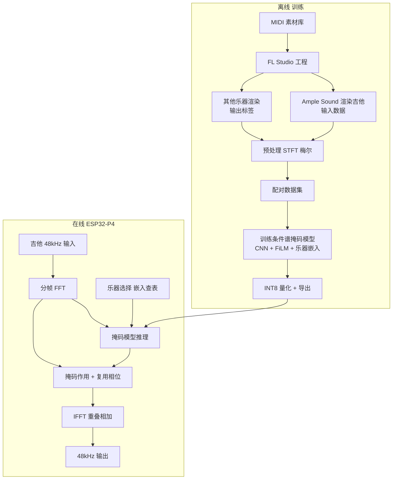
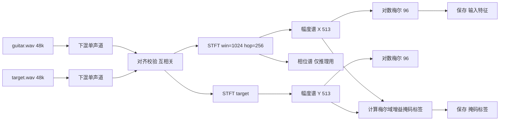
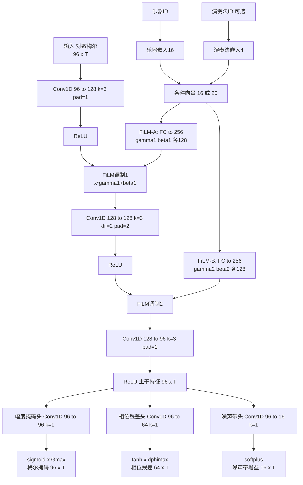
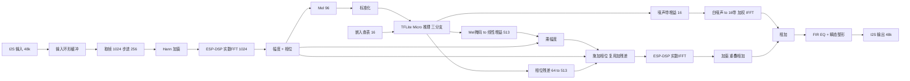
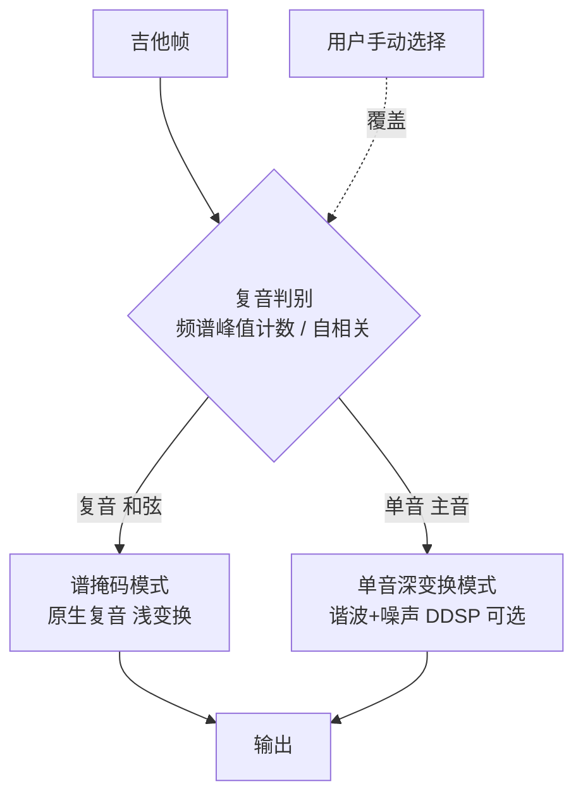

# 复音吉他实时音色转换 —— 完整实现文档

本文档给出"用吉他演奏(含和弦/复音)实时转换为其他乐器音色"系统的完整实现方案,覆盖:训练数据采集(Ample Sound + FL Studio)、数据预处理、模型结构、训练、量化导出、ESP32-P4 实时部署、失真效果器与双模切换、评估与落地路线。

核心技术路线:不做基频(F0)估计,改用**频域条件谱映射**——对输入吉他做 STFT,用条件 CNN(FiLM + 乐器嵌入)预测**频谱增益掩码**,作用在输入幅度谱上,复用输入相位做 IFFT 重建。该路线天然支持复音(和弦),且在 MCU 上算力与同时发声音符数无关。

默认参数(全文统一):采样率 48kHz、单声道、STFT 窗长 1024、帧移 256、Hann 窗、线性谱 513 bin、对数梅尔 96 维、乐器嵌入 16 维、掩码上限 Gmax=4.0、相位残差 64 带(上限 π/2)、噪声 16 带。

---

## 0. 系统总览



---

## 1. 训练数据采集(Ample Sound + FL Studio)

这是整个项目质量的地基。核心目标:**对同一段 MIDI,渲染出"严格时间对齐"的两路(或多路)音频——吉他(Ample Sound,作为输入)与目标乐器(作为输出标签)**。下面给出从素材设计到导出的完整流程与必须遵守的规则。

### 1.1 总原则(必须满足)

- **同一份 MIDI**:输入吉他与目标乐器必须由完全相同的 MIDI 音符驱动(同样的音高、起始时间、时长、力度)。
- **样本级对齐**:两路音频要逐帧对齐。最可靠的做法是在**一次渲染中用"拆分混音轨"导出**(见 1.5),由 FL Studio 统一做插件延迟补偿(PDC),保证起点一致、长度一致。
- **统一格式**:48000 Hz、单声道、24-bit 或 32-bit float WAV。
- **干信号**:关闭所有混响/EQ/压缩/限制器/母带效果。我们要的是裸音色。
- **关闭时间随机化**:Ample Sound 的"人性化/humanize"、随机起音、Strummer 自动扫弦位移等会让吉他音符偏离 MIDI 网格,导致与目标乐器**错位**。必须关闭这些时间扰动,让吉他严格按 MIDI 发声。音色层面的轮替采样(round-robin)可以保留。
- **电平一致**:关闭逐文件归一化(normalize)。各路保持一致的绝对电平,这样模型才能正确学习响度映射。

### 1.2 工程基础设置(FL Studio)

1. 采样率设为 48kHz:Options 1 > Audio Settings(导出时也在 Export 对话框确认 48000 Hz)。
2. 固定工程速度(如 120 BPM,实际数值不影响,只要两路同速)。
3. 关闭主输出(Master)上的所有效果器与限制器。
4. 关闭 Ample Sound 内置的混响/箱体/效果,使用干净 DI 输出;关闭其 Humanize、随机力度/时间、Strummer 的时间位移。
5. 目标乐器同样关闭自带的混响/效果,输出干信号;尽量将其设为单声道或居中,便于后续统一下混为单声道。

### 1.3 MIDI 素材设计(决定泛化能力)

数据要覆盖"真实弹吉他会出现的所有情形",尤其要包含大量**和弦/复音**,这是支持复音的关键。建议分类构造:

- **单音遍历**:吉他常用音域(约 E2~E6,MIDI 40~88)逐音,每个音多种力度(如 40 / 70 / 100 / 127)、多种时长(断奏短音、长持续音)。
- **音程**:大量两音同发(三度、四度、五度、八度等)。
- **和弦**:大三/小三/属七/小七/挂留/强力和弦(power chord)等;覆盖不同把位、转位与voicing;在吉他不同区域弹奏。
- **真实演奏片段**:扫弦进行、分解和弦(琶音)、闷音(palm-mute 节奏型)、不同节奏密度。
- **力度与动态**:同一素材用不同力度多次,让模型学到响度→音色的映射。
- **数据来源**:可手写、用和弦进行生成器,或导入公开的吉他 MIDI 数据集;务必人工或脚本校验音高落在目标乐器音域内(超出则限制或移调匹配)。

可按"每条 4~8 秒的片段"组织,便于后续切分与对齐管理。

> 演奏法标签(用于"演奏法嵌入",见 §3):采集时**记录每段/每音的 articulation/keyswitch 标签**(可从 MIDI 的 keyswitch 读出),写入 `meta.json`。若不使用演奏法嵌入可忽略,模型条件向量退化为仅乐器嵌入。

### 1.4 通道路由:让两路共享同一 MIDI

目标:Ample Sound 通道与目标乐器通道接收**完全相同**的音符。

- 在 Channel Rack 放入 Ample Sound 通道,写好钢琴卷帘(Piano Roll)音符。
- 复制该通道(右键 > Clone),把复制体的乐器替换为目标乐器 VST(FLEX / Sytrust / DirectWave / 第三方采样库等)。复制保证两者音符逐一相同。
- 将 Ample Sound 通道路由到混音器 Insert 1,目标乐器通道路由到 Insert 2(每个目标乐器各占一个 Insert)。
- 若要一次性渲染多个目标乐器:为每个目标乐器再克隆一个通道、各自占一个 Insert,全部由同一组音符驱动。

### 1.5 导出(保证样本级对齐的关键)

推荐用"拆分混音轨"一次性导出所有对齐音频:

1. File > Export > WAV file。
2. 勾选 **Split mixer tracks**(拆分混音轨):FL Studio 会为每个有信号的 Insert 各导出一个 WAV,且全部由同一渲染过程产生、做了统一 PDC,**起点与长度天然一致**。
3. 导出设置:48000 Hz;位深 24-bit 或 32-bit float;**关闭 Normalize**;启用 **Tail / Leave remainder**(保留尾音,避免释音被切断);Resampling 选高质量(如 Sinc)。
4. 结果:同一片段得到 `Insert1=guitar.wav`、`Insert2=<目标乐器>.wav` …,逐帧对齐。

若因故必须分别单独渲染(不推荐),务必:同一工程、同一片段、同一起止位置、同样开启 Tail,渲染后用互相关校验起点偏移并对齐(见第 2 章)。

### 1.6 单声道与电平处理

- 单声道:优先把乐器设为单声道/居中后渲染;若渲染为立体声,则在预处理阶段对两路同样做"左右求平均"下混,保持两路处理一致。
- 电平:全程关闭归一化;不要对单个文件单独提升/压低增益。响度信息要保留给模型学习。

### 1.7 目标乐器选择(与方法适配)

频域谱掩码保留了吉他的"时间包络/起音",因此对**持续/谐波类**目标乐器效果最佳:

- 推荐(适配好):风琴、合成 pad、弦乐群(小提琴/大提琴群感)、铜管、电钢、人声 "aah" 类持续音。
- 谨慎(局限明显):真实原声钢琴(锤击瞬态)、真实弓弦的"持续起音"——这类差异来自演奏方式而非音色,谱掩码无法重建,建议放到第 8 章的"单音 DDSP 深变换模式"处理,或作为已知局限对用户说明。

### 1.8 数据规模与目录约定

- 规模建议:每个目标乐器累计 1~3 小时音频,其中和弦/复音样本占足够比例(建议 >40%),以保证复音泛化。
- 目录结构建议:

```
dataset/
  raw/
    clip_0001/
      guitar.wav
      organ.wav
      strings.wav
      meta.json        # 采样率, 乐器列表, 来源MIDI, 片段时长
    clip_0002/
      ...
  midi/
    clip_0001.mid
    ...
```

- `meta.json` 记录:sample_rate=48000、channels=1、instruments=[...]、midi=clip_0001.mid、duration_s。后续脚本据此批量配对。

### 1.9 数据采集检查清单(逐条核对)

- [ ] 工程与导出均为 48kHz。
- [ ] 两路由同一 MIDI(克隆通道)驱动。
- [ ] 关闭 Humanize / 随机时间 / Strummer 时间位移。
- [ ] 关闭所有混响/EQ/压缩/限制器/母带效果(吉他与目标乐器都干信号)。
- [ ] 用 Split mixer tracks 一次性导出,保证对齐。
- [ ] 关闭 Normalize,保留尾音(Tail)。
- [ ] 单声道(或统一下混),电平一致。
- [ ] 和弦/复音样本比例足够。

---

## 2. 数据预处理与数据集格式

目标:把每个片段的 `guitar.wav` 与 `<target>.wav` 转成"逐帧对齐"的张量对,并生成训练用的掩码监督信号。

### 2.1 处理流水线



### 2.2 STFT 与梅尔参数

- STFT:窗长 `n_fft=1024`,帧移 `hop=256`,Hann 窗,中心填充。频点数 `513 = 1024/2 + 1`。
- 帧率:`48000 / 256 = 187.5 帧/秒`。
- 梅尔滤波器组:`n_mels=96`,频率范围 `[40, 16000] Hz`(覆盖吉他基频与重要泛音,又避开极低频噪声)。滤波器矩阵 `Mel[96 x 513]` 离线固定,推理端预存。
- 幅度:用幅度谱(magnitude),不是功率谱。对数压缩用 `log(mel + 1e-5)` 或 `log1p`。

### 2.3 对齐校验(关键)

即便用 Split mixer tracks 导出,也要做一次自动校验,防止个别片段错位:

1. 对 guitar 与 target 的能量包络(或低频段)做互相关,估计偏移 `delay`。
2. 若 `abs(delay)` 超过 1 个 hop(256 点),裁剪对齐;超过阈值(如 > 50ms)则标记该片段为可疑,人工复核或丢弃。
3. 对齐后两路统一裁到相同长度;不足处补零;丢弃纯静音帧(guitar 与 target 同时低于能量阈值的帧)。

> 关于对齐方式:对"同一 MIDI 双渲染"数据(同一 MIDI、一次 Split mixer tracks 渲染 + 宿主 PDC),输入与目标已**样本级对齐**,上述**互相关常数偏移**校正即足够,**不要用 DTW**——全局 DTW 会非线性扭曲真实时间轴、破坏"逐帧 t→t"的实时映射一致性(部署时输入是实时流,无法 DTW)。DTW 仅在训练数据来自**真实录音/不同演奏 take**(吉他与目标非同源渲染)时才考虑。

### 2.4 掩码标签的定义

模型学习"梅尔域增益掩码",标签由两路梅尔幅度谱直接相除得到(在梅尔域计算,与模型输出同域):

- 记吉他梅尔幅度 `Xmel[96, T]`,目标梅尔幅度 `Ymel[96, T]`。
- 理想掩码:`Mtarget = Ymel / (Xmel + eps)`,`eps=1e-4`。
- 截断到合理范围 `[0, Gmax]`,基线 `Gmax=4.0`(吉他无能量、目标有能量的频带不应被无限放大,截断可抑制噪声爆音)。
- 训练时模型直接回归 `Mtarget`(见第 4 章损失);推理时把梅尔掩码插值回 513 线性 bin 增益,乘到吉他线性幅度谱上。

> 说明:在梅尔域算掩码、再插值回线性域,是为了让"模型输出维度(96)"远小于线性 bin(513),从而显著减小模型与算力;代价是频率分辨率被梅尔分箱平滑,这对"音色包络变换"是可接受的(我们改的是包络而非精细音高结构)。

### 2.5 输入特征与归一化

- 模型输入:吉他对数梅尔谱 `log_mel_guitar[96, T]`。
- 归一化:在训练集上统计每个梅尔通道的均值/方差,做标准化 `(x - mean) / std`;`mean/std` 存盘,推理端复用(可折叠进模型首层或预处理)。
- 可选附加输入通道:整帧响度(对数 RMS)1 维,拼到特征上,帮助模型区分强弱奏。基线先不加,作为增强项。

### 2.6 数据集落盘格式

预处理结果建议存为分片的 `.npz`(或内存映射的 `.npy`),便于训练时随机读取:

```
dataset/
  proc/
    stats.npz                 # mel_mean[96], mel_std[96], 参数元信息
    mel_basis.npy             # Mel[96 x 513], 推理端也用
    shards/
      shard_0000.npz          # log_mel_guitar[96,T], mask_label[96,T], inst_id, clip_id
      shard_0001.npz
      ...
```

每个训练样本是一段定长帧序列(如 `T=128` 帧 ≈ 0.68s)的窗口,从片段中滑窗切出;记录其 `inst_id`(目标乐器索引,用于查嵌入)。

### 2.7 预处理脚本接口(约定)

```
# scripts/preprocess.py
# 用法: python preprocess.py --raw dataset/raw --out dataset/proc \
#        --sr 48000 --n_fft 1024 --hop 256 --n_mels 96 --fmin 40 --fmax 16000 \
#        --gmax 4.0 --win_frames 128 --instruments organ,strings,epiano
# 功能: 遍历 raw/clip_*/，做下混→对齐校验→STFT→梅尔→掩码标签→切窗→写 shards 与 stats。
```

---

## 3. 模型结构(条件谱掩码 CNN)

用 FiLM + 乐器嵌入做条件控制。把 **96 维梅尔作为通道、帧 T 作为序列维**,用 Conv1D 在时间方向上做小感受野卷积。网络是一个**共享主干 + 三个输出头**的结构:

- **幅度掩码头**:输出梅尔增益掩码,重塑频谱包络(音色主体)。
- **相位残差头**:输出有界、低分辨率的线性域相位残差,消除"复用吉他相位"带来的吉他味/群延迟着色。
- **噪声带头**:输出 B 个噪声带增益,合成滤波白噪声补足拨片/琴槌/气息等无谐波瞬态。

三头共享主干,推理时三者一次前向得到,额外算力很小(详见 §6、附录 F)。若部署受限,可单独关闭相位残差头(退化为纯相位复用),听感仍可用。

### 3.1 数据流与维度



### 3.2 逐层规格

主干(backbone):

| 层 | 类型 | 输入→输出通道 | 核 / 膨胀 | 激活 | 备注 |
|---|---|---|---|---|---|
| L0 | 输入 | 96 (mel) | - | - | 每帧 96 维梅尔作为通道,T 为序列维 |
| L1 | Conv1D | 96→128 | k=3, d=1, pad=1 | ReLU | |
| F1 | FiLM | 128 | - | - | 条件→gamma1/beta1 |
| L2 | Conv1D | 128→128 | k=3, d=2, pad=2 | ReLU | 膨胀=2 扩大时间感受野 |
| F2 | FiLM | 128 | - | - | 条件→gamma2/beta2 |
| L3 | Conv1D | 128→96 | k=3, d=1, pad=1 | ReLU | 输出主干特征 96×T |

三个输出头(均从主干特征 96×T 分出,k=1 卷积):

| 头 | 类型 | 输出通道 | 激活 | 输出 | 用途 |
|---|---|---|---|---|---|
| 幅度掩码头 | Conv1D k=1 | 96 | sigmoid×Gmax | 梅尔增益掩码 [96,T],值域 [0,Gmax] | 频谱包络/音色主体 |
| 相位残差头 | Conv1D k=1 | 64 (=P) | tanh×Δφmax | 低分辨率线性相位残差 [64,T],值域 [-Δφmax,+Δφmax] | 去吉他味/群延迟修正 |
| 噪声带头 | Conv1D k=1 | 16 (=B) | softplus | 噪声带增益 [16,T],非负 | 瞬态/无谐波成分 |

- **乐器嵌入**:`nn.Embedding(num_instruments, 16)`。每个目标乐器一个 16 维可学习向量,支持乐器间插值得到混合音色。
- **演奏法嵌入(可选)**:`nn.Embedding(num_articulations, 4)`,与乐器嵌入拼接成条件向量(16 或 20 维);需数据带 articulation/keyswitch 标签(见 §1.3、附录 C)。无标签则不启用,条件向量即 16 维。
- **FiLM**:每个调制层一个全连接 `cond_dim → 2*C`(C=128),输出切成缩放 `gamma`、平移 `beta`,做 `y = gamma * x + beta`。
- **输出激活**:幅度掩码 `sigmoid(z)*Gmax`(Gmax=4.0);相位残差 `tanh(z)*Δφmax`(Δφmax=π/2),保证有界、平滑,不破坏复音相位相干;噪声带增益 `softplus(z)` 保证非负。

### 3.3 参数量与算力(粗估)

- 主干权重:L1 `96*128*3≈37k`、L2 `128*128*3≈49k`、L3 `128*96*3≈37k`;三头 `96*96 + 96*64 + 96*16 ≈ 16k`;FiLM 全连接 `16*256*2≈8k`,合计约 **0.16M 参数**。INT8 下约 **160 KB** 权重,适合 MCU。
- 每帧乘加(MAC)约等于上述权重数(沿时间轴一次卷积),量级 ~`1.5e5 MAC/帧`;`187.5 帧/秒` → ~`2.8e7 MAC/s`,对 P4 是轻负载。真正的算力大头在 FFT/IFFT 与相位旋转(见第 6 章、附录 D)。

### 3.4 PyTorch 参考实现(训练用)

```python
# model.py
import torch, torch.nn as nn
import math

class FiLM(nn.Module):
    def __init__(self, cond_dim, channels):
        super().__init__()
        self.fc = nn.Linear(cond_dim, channels * 2)
        self.channels = channels
    def forward(self, x, cond):          # x:[B,C,T], cond:[B,cond_dim]
        gb = self.fc(cond)               # [B, 2C]
        gamma, beta = gb[:, :self.channels], gb[:, self.channels:]
        return x * gamma.unsqueeze(-1) + beta.unsqueeze(-1)

class MaskNet(nn.Module):
    def __init__(self, n_mels=96, n_inst=8, emb_dim=16, n_artic=0, artic_dim=4,
                 gmax=4.0, phase_bands=64, dphi_max=math.pi/2, noise_bands=16):
        super().__init__()
        self.gmax, self.dphi_max = gmax, dphi_max
        self.emb = nn.Embedding(n_inst, emb_dim)
        self.use_artic = n_artic > 0
        self.aemb = nn.Embedding(n_artic, artic_dim) if self.use_artic else None
        cond_dim = emb_dim + (artic_dim if self.use_artic else 0)
        self.c1 = nn.Conv1d(n_mels, 128, 3, padding=1)
        self.f1 = FiLM(cond_dim, 128)
        self.c2 = nn.Conv1d(128, 128, 3, padding=2, dilation=2)
        self.f2 = FiLM(cond_dim, 128)
        self.c3 = nn.Conv1d(128, n_mels, 3, padding=1)
        self.head_mag = nn.Conv1d(n_mels, n_mels, 1)        # 幅度掩码
        self.head_phase = nn.Conv1d(n_mels, phase_bands, 1)  # 相位残差(低分辨率)
        self.head_noise = nn.Conv1d(n_mels, noise_bands, 1)  # 噪声带增益
        self.act = nn.ReLU()
    def forward(self, x, inst_id, artic_id=None):  # x:[B,n_mels,T]
        cond = self.emb(inst_id)
        if self.use_artic and artic_id is not None:
            cond = torch.cat([cond, self.aemb(artic_id)], dim=-1)
        h = self.f1(self.act(self.c1(x)), cond)
        h = self.f2(self.act(self.c2(h)), cond)
        h = self.act(self.c3(h))
        mask = torch.sigmoid(self.head_mag(h)) * self.gmax        # [B,n_mels,T]
        dphi = torch.tanh(self.head_phase(h)) * self.dphi_max     # [B,P,T]
        noise = torch.nn.functional.softplus(self.head_noise(h))  # [B,B_bands,T]
        return mask, dphi, noise
```

> 时间方向与流式:把 96 维梅尔作为通道、T 作为序列维,卷积核在 T 方向滑动。主干总时间感受野很小(k=3 两层 + 膨胀 2,约 ±4 帧)。训练用对称 padding;**实时流式部署改为因果 padding(只用过去帧)** 或把主干设为 `k=1`,以消除未来帧依赖。两者在持续音上差异很小;对延迟敏感场景直接用因果或 k=1。
>
> 部署可关闭项:若 INT8 后相位伪影或 CPU 超预算,可关闭相位残差头(`dphi=0`,等价纯相位复用);噪声头与后处理成本极低,通常保留。

---

## 4. 训练流程、损失函数与超参

### 4.1 混合损失函数

最终损失同时约束"掩码域、重建谱域、波形谱域、相位、对抗",兼顾收敛性与听感:

1. **梅尔掩码 L1**(主损失,易收敛):
   `L_mask = mean( | mask_pred - mask_label | )`,`mask_label = clip(Ymel/(Xmel+mask_eps), 0, Gmax)`。

2. **重建对数梅尔 L1**(对齐听感、关照弱信号):`Yhat_mel = mask_pred ⊙ Xmel`;
   `L_logmel = mean( | log(Yhat_mel+eps) - log(Ymel+eps) | )`。

3. **多分辨率 STFT 谱损失**:把梅尔掩码插值回线性 bin、乘吉他幅度谱、施加(预测相位残差后的)相位做 ISTFT 得到音频,叠加噪声带合成,再与目标音频在多组 `(n_fft,hop)∈{(2048,512),(1024,256),(512,128)}` 上比线性+对数幅度谱。**同时约束谐波与瞬态**,并隐式监督噪声带头。

4. **复数 STFT 损失**(启用相位残差头时):在**线性域**约束复数谱
   `L_cplx = mean( | S_target - Mcplx ⊙ S_guitar | )`,`Mcplx = gain_lin · exp(j·Δφ_lin)`。注意相位无法在梅尔域表达,此项必须在线性域。

5. **对抗损失 + 特征匹配**(后期微调,仅训练、不部署):多分辨率谱判别器判别重建音频真伪,配合特征匹配损失稳训练,消除 L1 的"平均化发闷"。

最终加权:

```
L =  1.00 * L_mask
   + 0.50 * L_logmel
   + 0.10 * L_mrstft
   + 0.10 * L_cplx        # 启用相位残差头时
   + 0.01 * L_adv         # 后期微调阶段
```

> 分阶段开启(避免一次性全开难收敛):先 `L_mask + L_logmel + L_mrstft` 训到收敛 → 加 `L_cplx`(相位)→ 最后加 `L_adv` 微调。
>
> 在对数域比较谱能更好匹配人耳响度感知,避免高能量频带主导损失。噪声带头无需显式分离监督,由多分辨率 STFT + 对抗损失隐式驱动它去解释"掩码无法解释的宽带残差"。

### 4.2 训练超参(基线)

| 项 | 值 |
|---|---|
| 优化器 | Adam |
| 学习率 | 3e-4,余弦退火或 ReduceLROnPlateau |
| Batch | 32 个窗口(每窗 T=128 帧) |
| Epochs | 100~300(早停,看验证 L_logmel) |
| 权重衰减 | 1e-5 |
| 梯度裁剪 | 1.0 |
| 划分 | 按"片段/MIDI 来源"划分 train/val/test,避免同一片段泄漏到验证集 |
| 设备 | 单 GPU 即可;模型很小,CPU 也能训(慢) |

### 4.3 训练循环(参考)

```python
# train.py (核心片段)
for batch in loader:                  # x, mask_lab, Xmel, Ymel, inst_id, (artic_id), target_wav
    mask, dphi, noise = model(batch.x, batch.inst_id, batch.artic_id)  # 三分支输出
    L_mask  = (mask - batch.mask_lab).abs().mean()
    Yhat    = mask * batch.Xmel
    L_logmel = ((Yhat + EPS).log() - (batch.Ymel + EPS).log()).abs().mean()
    # 重建音频(梅尔掩码插值回线性 -> 施加相位残差 -> 叠加噪声带合成)
    yhat_wav = reconstruct(batch.Xlin, batch.phase, mask, dphi, noise)
    L_mrstft = multi_res_stft(yhat_wav, batch.target_wav)
    loss = 1.0*L_mask + 0.5*L_logmel + 0.1*L_mrstft
    if use_phase:  loss = loss + 0.1 * complex_stft(batch.Slin_t, gain_lin, dphi)
    if use_adv:    loss = loss + 0.01 * adversarial(yhat_wav, batch.target_wav)
    opt.zero_grad(); loss.backward()
    torch.nn.utils.clip_grad_norm_(model.parameters(), 1.0)
    opt.step()
```

### 4.4 域增强(缩小"渲染吉他"与"真实吉他输入"的差距)

部署时输入是真实拾音的吉他,与 Ample Sound 渲染存在域差。**只对输入吉他做增强,目标标签不变**:

- 加性噪声:轻微白噪/拾音底噪(随机 SNR 30~50 dB)。
- 随机 EQ:随机一阶/峰值滤波,模拟不同拾音器/木吉他箱体。
- 电平扰动:随机增益 ±6 dB(同时作用于输入幅度与掩码标签的一致性需注意:增益作用在输入吉他音频上,掩码标签需按"目标不变、输入变化"重新计算,或等价地在梅尔域对输入做平移、对掩码做反向补偿)。
- 轻微失谐/微音高漂移、轻度时间抖动:±数音分,模拟真实演奏与弦况。
- 混响/房间(谨慎):少量早期反射;过强会破坏对齐与干信号假设,默认关或很弱。

实现上,增强可在预处理后于"梅尔特征"层面近似(更快),或回到音频层面做(更真实)。基线:音频层面做噪声+EQ+增益,其余按需。

### 4.5 训练监控与产物

- 监控:验证集 `L_logmel`、重建音频的多分辨率 STFT 距离;定期导出几条 demo 音频人工试听(最关键)。
- 产物:`masknet.pt`(权重)、`stats.npz`、`mel_basis.npy`、`mel_inv.npy`、`embeddings`(乐器/演奏法嵌入表)、训练配置 `config.yaml`。

---

## 5. 推理与音频重建

推理时不需要目标音频,只用吉他输入与所选乐器(及可选演奏法)嵌入。完整重建链:

1. 分帧:1024 点窗、256 点帧移、Hann 窗。
2. FFT → 线性幅度谱 `Xlin[513]` 与相位 `phase[513]`。
3. 线性幅度 → 对数梅尔 `Xmel[96]`(乘 `Mel[96x513]`,取 log,标准化)。
4. 模型一次前向 → 三分支:`mask_mel[96]`、相位残差 `dphi[64]`、噪声带增益 `noise[16]`。
5. 梅尔掩码 → 线性增益 `gain_lin[513]`:乘预存 `MelInv[513x96]`(见 §5.1)。
6. 相位残差展开:`dphi[64]` 平滑插值到 `dphi_lin[513]`(预存 `[513x64]` 插值矩阵)。
7. 谐波/音调部分:`Ylin = gain_lin ⊙ Xlin`;复数谱 `Y = Ylin · exp( j·( phase + dphi_lin ) )`;IFFT + Hann 加窗 + 重叠相加(OLA)→ 时域 `y_tonal`。
8. 噪声部分:`noise[16]` 经 16 个带权重展开为线性谱形,调制白噪声(随机相位)→ IFFT + OLA → `y_noise`。
9. 相加:`y = y_tonal + y_noise`。
10. 后处理:固定 FIR 频带补偿(校正系统性频带偏差)+ 轻量瞬态整形(包络跟踪 + 一阶微分,默认低量)。
11. 稳定性:`gain_lin` 帧间一阶平滑(a=0.5)抑制掩码抖动;低能量帧噪声门直接静音,防放大底噪。

> 相位与复音:幅度掩码是非负实增益,只改幅度不改音高梳状结构,**复音(和弦)的所有音高被原样保留**;相位以**复用吉他相位为主干 + 有界低分辨率残差 `Δφ` 微调**,既去掉吉他味/群延迟着色,又不破坏和弦的相位相干性。OLA 用 `hop=256`、Hann 窗满足 COLA 条件,重建无调幅。
>
> 部署可关闭项:若 INT8 后相位伪影或 CPU 超预算,令 `dphi=0`(纯相位复用),其余链路不变,听感仍自然可用。

### 5.1 梅尔→线性增益的展开

- 训练时:`Xmel = Mel @ Xlin`(`Mel` 为 `[96x513]` 三角滤波器组)。
- 推理时需要把 96 维"梅尔增益"映射回 513 维"线性增益"。两种做法:
  - (a) 插值法:把每个梅尔通道增益按三角权重分配回线性 bin,等价于 `gain_lin = normalize(Mel^T @ mask_mel)`(`Mel^T` 为 `[513x96]`,按列归一化避免叠加放大)。预存 `MelInv=[513x96]`。
  - (b) 最近邮/线性插值:沿梅尔中心频率对增益做分段线性插值到 513 bin。
- 基线用 (a),`MelInv` 离线算好存为 `mel_inv.npy`,MCU 端是一次 `513x96` 矩阵乘(约 49k MAC/帧,轻量)。

---

## 6. 量化、导出与 ESP32-P4 实时部署

### 6.1 INT8 量化与 TFLite 导出

模型很小,适合全 INT8。两条路线:

- **路线 1(推荐,TFLite Micro 生态成熟)**:PyTorch 训练 → 导出 ONNX → 转 TensorFlow → TFLite,启用**训练后整型量化(PTQ)**,提供有代表性的校准集(几百~几千帧真实分布的梅尔特征)。产出 `masknet_int8.tflite`。
- **路线 2**:直接用 TensorFlow/Keras 复刻同结构训练,`TFLiteConverter` + `representative_dataset` 出 INT8。省去跨框架转换的坑。

量化注意:

- 输入(标准化后的对数梅尔)与三个输出头(幅度掩码、相位残差、噪声带增益)都用代表性数据定标度(scale/zero-point)。
- `sigmoid/tanh/softplus` 在 INT8 下精度一般足够;FiLM 的乘加在量化图里要确认被正确融合。
- **相位残差头对量化敏感**:建议该头保持 int16 或局部 float;务必用含和弦的校准集验证。若量化后出现相位伪影,令 `dphi=0` 回退为纯相位复用(见 §5)。
- 校准集要包含**和弦/复音**与不同力度的帧,避免量化范围偏置。
- 验证:对比 FP32 与 INT8 在验证集上的 `L_logmel`、重建音频多分辨率 STFT 距离与试听差异,掩码误差通常对听感不敏感,INT8 一般可接受。

### 6.2 嵌入表导出

乐器嵌入是查表常量,导出为 C 头文件:

```c
// instrument_embeddings.h  (示例)
#define NUM_INSTRUMENTS 8
#define EMB_DIM 16
static const float kInstEmb[NUM_INSTRUMENTS][EMB_DIM] = {
  /* organ   */ { 0.12f, -0.04f, /* ... 共16 */ },
  /* strings */ { /* ... */ },
  /* epiano  */ { /* ... */ },
  // ...
};
// 可选: articulation_embeddings.h, [NUM_ARTIC][4]
```

运行时根据用户选择的乐器索引取一行 16 维向量(如启用演奏法,再拼接 4 维),送入模型的 FiLM 输入。乐器插值 = 两行向量的线性插值(混合音色)。

### 6.3 ESP32-P4 端处理链与缓冲



- FFT/IFFT:用 ESP-DSP 的实数 FFT(`dsps_fft2r` / `dsps_rfft`)以利用 RISC-V SIMD/DSP 扩展,1024 点。
- 内存:输入/输出环形缓冲、窗系数表、`Mel[96x513]`、`MelInv[513x96]`、`PhaseInv[513x64]`、噪声带 `[16x513]`、sin/cos 相位查表、模型 arena。各矩阵 KB~百 KB 级,可放 PSRAM;紧张时用稀疏存储(每三角只覆盖少量 bin)。
- 双核:核 0 跑音频 I/O + FFT/重建/噪声/后处理,核 1 跑 TFLite Micro 推理,乒乓缓冲解耦。

### 6.4 延迟预算(目标端到端 < ~30ms)

| 环节 | 估计 |
|---|---|
| 输入成帧(凑满 1024,首帧)| ~21.3 ms(1024/48k);稳态下每 hop 出一帧,增量 5.3 ms |
| FFT + 梅尔 + 三分支推理 + 反映射 + 相位旋转 + 噪声合成 + IFFT + 后处理 | 每帧需 < hop(5.3ms) |
| OLA 输出缓冲 | ~1 个 hop |
| I2S DMA 缓冲 | 取决于 DMA 块大小,几 ms |

每帧处理的相对开销(详见附录 D):

| 模块 | 相对开销 | 说明 |
|---|---|---|
| 幅度掩码 + 梅尔反映射 | 基准 | 主路径 |
| 噪声带合成 | 极低 | LFSR + 16 带加权 |
| 相位残差应用 | 低~中 | 513 bin 复数旋转,sin/cos 查表;**唯一非平凡增量** |
| FIR EQ + 瞬态整形 | 极低 | 固定系数 |

- 实时硬约束:**每帧处理 < hop = 5.33ms**;模型 + FFT 在 P4 上有较大裕量,新增主要是相位旋转,需实测确认。
- 算法延迟主要来自分析窗(1024≈21ms)与缓冲。要更低延迟可减小窗(如 512/128),代价是频率分辨率下降、低音区掩码变粗。
- 因果 / k=1 主干可进一步降低时延依赖;相位残差头若超预算可关闭(`dphi=0`)。

### 6.5 稀疏稳定性处理(避免爆音)

- 掩码截断 `Gmax` 防止吉他静音帧被放大成噪声。
- 增益平滑:对 `gain_lin` 做帧间一阶平滑(`g = a*g_prev + (1-a)*g_new`,`a≈0.5`),抑制掩码抖动导致的"水声/musical noise"。
- 噪声门:对极低能量输入帧直接输出静音,避免放大底噪。

---

## 7. 失真效果器(传统 DSP,替代 WaveNet)

原方案的因果 WaveNet 在 48kHz 上逐采样自回归,400MHz MCU 实时不可行,且没必要。失真用经典 DSP,几乎零算力且对复音同样适用:

- **波形整形(waveshaping)/软削波**:逐采样无记忆非线性,如 `y = tanh(k*x)`、立方软削波 `y = x - x^3/3`(限幅域内),或多项式整形。`k` 控制驱动量(gain/drive)。
- **过采样抗混叠**:强失真会产生高频谐波,易混叠。对驱动级做 2x~4x 过采样(多相 FIR 上采样 → 非线性 → 抗混叠低通 → 抽取)。轻度失真可省。
- **音箱模拟(可选)**:用一段短脉冲响应(IR)做卷积,模拟吉他箱体/喇叭。IR 取几百~上千点,用分块卷积或直接 FIR;算力可控。
- **信号链**:输入 → (可选输入 EQ) → 驱动/整形 → 抗混叠 → (可选 IR) → 输出电平。
- **与音色转换的关系**:失真是独立的并行/串行效果模式,不占用神经网络算力;可与谱掩码音色转换串联(如先转音色再轻微染色)。

---

## 8. 复音/单音双模与目标乐器适配

本方案主线是**频域谱掩码模式**(原生复音)。作为可选的产品功能,可在**单音**时切换到更深的变换模式:



- **复音/和弦模式(主线)**:频域谱掩码,鲁棒支持任意复音,做"包络/音色染色"类变换(吉他→风琴/pad/弦乐群)。
- **单音/主音模式(可选)**:单音时可走谐波+噪声 DDSP,做更深的变换(主音吉他→小提琴持续音);需要单音 F0,只在单音时启用。
- **自动判别**:统计当前帧显著谱峰数量,或用自相关/谱平坦度判断单音 vs 复音;也可由用户手动锁定模式。
- **目标乐器适配回顾**:谱掩码保留吉他时间包络,最适合持续/谐波类音色;锤击瞬态(真钢琴)、持续起音(真弓弦)交给单音模式或接受为已知局限(见 §1.7)。

---

## 9. 评估方法

- **客观指标**:验证/测试集上的对数梅尔谱 L1、多分辨率 STFT 距离;掩码 MAE。
- **复音专项**:构造纯和弦测试集,检查转换后各音高是否保留(对输出做谱峰检测,与输入音高对比),确认没有"和弦塌缩成单音"。
- **主观试听(最重要)**:固定一组 demo(单音、双音、和弦、扫弦、分解和弦),A/B 试听;关注音色像不像目标、和弦是否清晰、有无 musical noise/水声、瞬态是否自然。
- **域差评估**:用真实拾音吉他(非渲染)录几段,试听域增强前后的鲁棒性。
- **端侧评估**:在 ESP32-P4 实测每帧处理耗时(必须 < hop=5.3ms)、端到端延迟、CPU/内存占用、长时间运行稳定性(无爆音/溢出)。

---

## 10. 工程落地路线图

按"先把核心听感做对、再逐项加码"的顺序构建最终方案(每一步都向最终设计收敛,不是不同版本):

1. **离线 PoC(单乐器,幅度掩码 + 复用相位)**:打通 STFT → 谱掩码 CNN → ISTFT,在 1 个目标乐器(建议风琴/pad)上验证和弦音色变换听感。这是最小可听原型。
2. **加噪声带头 + 混合损失(多分辨率 STFT)**:补瞬态、约束谐波,最高性价比,优先做。
3. **多乐器 + FiLM/乐器嵌入**:同一 MIDI 双渲染的多乐器数据集,验证乐器切换与插值。
4. **加对抗训练微调(训练期,推理零成本)**:去"平均化发闷"、补高频细节。
5. **加有界相位残差头**:去吉他味/群延迟着色;同步做 INT8 量化验证与 `dphi=0` 回退开关。
6. **域增强 + 真实吉他鲁棒性**:噪声/EQ/电平/失谐增强,用真实拾音输入验证。
7. **条件增强 + 后处理**:乐器嵌入 16(及可选演奏法嵌入)、FIR EQ、轻瞬态整形。
8. **量化与端侧落地**:INT8 + TFLite Micro,在 P4 跑通 FFT/三分支推理/相位旋转/噪声合成/IFFT,实测每帧耗时、端到端延迟、内存;不足则关相位残差头。
9. **双模与效果器**:接入单音深变换模式 + 复音/单音自动切换(见 §8);接入波形整形失真(见 §7)。

---

## 11. 建议仓库结构

```
poly-timbre-transfer/
  docs/
    IMPLEMENTATION.md         # 本文档
  scripts/
    preprocess.py             # 数据预处理(STFT/梅尔/掩码标签/切窗)
    align_check.py            # 对齐校验工具
    export_tflite.py          # ONNX/TF -> INT8 TFLite
    export_embeddings.py      # 导出嵌入 C 头文件
  src/
    model.py                  # MaskNet + FiLM
    dataset.py                # shard 读取与增强
    train.py                  # 训练循环
    infer.py                  # 离线推理(完整重建链:掩码+相位残差+噪声+后处理)
    audio.py                  # STFT/ISTFT/梅尔/OLA 工具
    fx.py                     # 波形整形失真
  firmware/                   # ESP32-P4 (后续阶段)
    main/                     # I2S, FFT(ESP-DSP), TFLite Micro 集成
  dataset/                    # 数据(raw/proc, 不入库)
  requirements.txt
  README.md
```

---

## 12. 与原(单音 DDSP)方案的关键差异

| 维度 | 原方案(单音 DDSP) | 本方案(频域谱掩码) |
|---|---|---|
| 合成端 | 谐波+噪声加性合成 | 谱掩码 + 相位复用 IFFT |
| 是否需要 F0/多音高 | 需要(复音崩) | 完全不需要 |
| 复音支持 | 不支持 | 原生支持 |
| 模型输出 | 40 维合成参数 | 96 维梅尔增益掩码 |
| MCU 算力 | 随音符数上升 | 与音符数无关,固定 |
| 变换深度 | 深(可改起音) | 浅(保留吉他时间包络) |
| 保留设计 | - | FiLM + 乐器嵌入 + 同一 MIDI 双渲染数据管线 |

> 取舍总结:本方案以"放弃改写时间包络/起音"为代价,换来"原生复音 + 固定低算力 + 低延迟 + 训练易收敛",非常契合"吉他和弦 → 持续/谐波类乐器"的实时 MCU 场景。需要深度变换时,叠加单音 DDSP 模式即可。

---

## 13. 设计依据与可行性

本节给出正文(§3–§6)这套最终设计背后的取舍依据:各关键技术的裁决、两个必须澄清的技术点、以及端侧成本结论。设计细节本身见对应正文章节。

### 13.1 关键技术裁决表

按 **(收益 × 鲁棒性) / 成本** 排序(MCU 实时 + 复音约束):

| 优先级 | 策略 | 裁决 | 推理额外算力 | 训练成本 | 关键修正 / 风险 |
|---|---|---|---|---|---|
| P1 | 混合损失(多分辨率STFT+对数) | 采纳 | 零 | 仅训练 | 多分辨率STFT需重建音频(配合相位/复用相位) |
| P1 | 加性噪声合成(噪声带增益) | 采纳 | 极低 | 无 | 改为"噪声带增益"而非单一宽带增益,谱形更准 |
| P2 | 对抗训练(GAN) | 采纳(后期) | 零(判别器不部署) | 高且不稳定 | 必加特征匹配损失稳训练;先训好回归再加 |
| P2 | 复数掩码 / 相位修正 | 采纳并修正 | 中(唯一非平凡增量) | 略增 | 相位不能在梅尔域;改"有界+低分辨率相位残差";INT8 敏感 |
| P3 | 条件增强(嵌入扩维+演奏法) | 采纳(看数据) | 可忽略 | 略增 | 演奏法嵌入要求数据带 keyswitch/articulation 标签 |
| P3 | 推理端后处理(FIR EQ+瞬态) | 采纳 | 极低 | 无 | 瞬态锐化要轻,过度会发硬/抬噪 |
| P4 | DTW 对齐 | 仅特定数据 | 零 | 仅预处理 | 同一 MIDI 渲染已样本级对齐,通常不需要;见 §2.3 |

### 13.2 两个必须澄清的技术点

1. **"复数梅尔掩码"在数学上不成立。** 梅尔滤波是对**幅度谱**的有损线性压缩,**不携带相位**。因此相位修正**不能在梅尔域**进行,必须放到**线性频域(513 bin)或独立的低分辨率线性栅格**上。最终做法(§3、§5):幅度掩码在梅尔域(96),**相位残差另开一条线性域分支**(低分辨率 P=64、有界 tanh×Δφmax)。

2. **DTW 对"同一 MIDI 双渲染"数据是多余的。** 输入吉他与目标乐器由**同一 MIDI、同一次渲染(Split mixer tracks + PDC)**产生,音符起始已**样本级对齐**。插件残余延迟用 §2.3 的**互相关常数偏移**校正即可;全局 DTW 反而会扭曲真实时间轴、破坏逐帧实时映射一致性。DTW 仅用于**真实录音/不同演奏 take**。

### 13.3 端侧成本结论

各项相对推理成本(部署后,详见附录 D):

| 模块 | 推理额外算力 | 说明 |
|---|---|---|
| 幅度掩码 + 梅尔反映射 | 基准 | 主路径 |
| 噪声带合成(B=16) | 极低 | LFSR + 16 带加权 |
| 相位残差应用 | 低~中 | 513 bin 复数旋转,sin/cos 查表;**唯一非平凡增量** |
| FIR EQ + 瞬态整形 | 极低 | 固定系数 |
| 判别器 / 多分辨率 / 复数 / 对抗损失 / DTW | 零 | **仅训练**,不部署 |

> 结论:推理端真正"近零成本"的是噪声合成、后处理与全部训练期手段(GAN / 混合损失 / DTW);**相位残差是唯一带来非平凡推理增量与量化风险的项**,需在 P4 实测,超预算时令 `dphi=0` 回退。整体可在实时约束内显著逼近真实乐器音色,算力/延迟仅小幅可控增加。

---

# 附录

以下附录把正文中的设计落到"可直接执行"的颗粒度:统一符号、全参数表、逐步操作、数值预算、算法伪代码、张量明细、端侧部署细节、评估协议、风险与排错、数据 schema、乐器音域、验收标准。

## 附录 A. 符号与术语表

### A.1 数学符号

| 符号 | 含义 | 维度/取值 |
|---|---|---|
| `sr` | 采样率 | 48000 Hz |
| `n_fft` | STFT 窗长(FFT 点数) | 1024 |
| `hop` | 帧移 | 256 |
| `n_bins` | 线性频点数 = n_fft/2 + 1 | 513 |
| `n_mels` | 梅尔通道数 | 96 |
| `T` | 一个训练窗的帧数 | 128(≈0.68 s) |
| `Xlin` | 吉他线性幅度谱 | [n_bins, T] |
| `phase` | 吉他相位谱 ∠Xlin | [n_bins, T] |
| `Xmel` | 吉他对数梅尔幅度 | [n_mels, T] |
| `Ymel` | 目标乐器对数梅尔幅度 | [n_mels, T] |
| `Mel` | 梅尔滤波器组 | [n_mels, n_bins] |
| `MelInv` | 梅尔→线性增益展开矩阵 | [n_bins, n_mels] |
| `mask_mel` | 预测的梅尔增益掩码 | [n_mels, T],值域 [0, Gmax] |
| `gain_lin` | 线性域增益 = MelInv·mask_mel | [n_bins, T] |
| `Gmax` | 掩码上限 | 4.0 |
| `e` | 乐器嵌入向量 | 16 维(可选拼接演奏法 4 维) |
| `gamma, beta` | FiLM 缩放/平移系数 | 每层 = 通道数(128) |
| `Δφ` | 相位残差 | 低分辨率 P 带→插值到 n_bins,有界 [-Δφmax, +Δφmax] |
| `Δφmax` | 相位残差上限 | π/2 ≈ 1.5708 |
| `B` | 噪声带数 | 16 |
| `eps` | 对数下限 | 1e-5 |
| `mask_eps` | 掩码分母下限 | 1e-4 |

### A.2 术语

- **DDSP**(Differentiable DSP):可微数字信号处理,用神经网络预测合成器参数。本方案借鉴其"滤波噪声"思想(§13.2),但主合成走频域谱掩码而非加性谐波。
- **FiLM**(Feature-wise Linear Modulation):用条件向量生成逐通道的 `gamma/beta`,对特征做 `gamma*x+beta` 调制,实现轻量条件控制。
- **谱掩码(Spectral Mask)**:作用在输入幅度谱上的非负增益,重塑频谱包络而保留音高梳状结构,因此**原生支持复音**。
- **相位复用(Phase Reuse)**:重建时直接沿用输入吉他的相位谱作为主干,再叠加网络预测的有界相位残差 `Δφ` 做微调(相位残差头关闭时即纯复用)。
- **OLA**(Overlap-Add):帧重建的重叠相加;Hann 窗 + hop=256 满足 COLA(常量重叠相加)条件,重建无调幅。
- **PDC**(Plugin Delay Compensation):宿主对各插件延迟的自动补偿,保证多轨样本级对齐。
- **keyswitch / articulation**:采样音源用特定音符或控制切换演奏法(如滑音、泛音、闷音)。
- **复音 / 复调(Polyphony)**:多个音高同时发声(和弦);与之相对是单音(monophonic)。
- **PTQ**(Post-Training Quantization):训练后量化(本方案 INT8 部署的主路径)。

## 附录 B. 全参数参考表(唯一来源)

实现时所有模块从此表取值,避免散落不一致。

### B.1 音频/STFT/梅尔

| 参数 | 值 | 备注 |
|---|---|---|
| sample_rate | 48000 | 单声道 |
| n_fft | 1024 | Hann 窗 |
| hop | 256 | 75% 重叠 |
| n_bins | 513 | = n_fft/2+1 |
| 帧率 | 187.5 fps | = sr/hop |
| 窗时长 | 21.33 ms | = n_fft/sr |
| 帧移时长 | 5.33 ms | = hop/sr |
| n_mels | 96 | |
| fmin / fmax | 40 / 16000 Hz | 梅尔范围 |
| 梅尔尺度 | HTK(2595·log10(1+f/700)) | 见附录 E |
| win_frames(T) | 128 | 训练窗 ≈ 0.68 s |
| 幅度类型 | magnitude(非功率) | |
| 对数压缩 | log(mel + 1e-5) | |

### B.2 模型

| 参数 | 值 |
|---|---|
| 输入维度 | 96(对数梅尔) |
| 主干 | Conv1D 96→128→128→96 + FiLM×2 |
| 通道 hidden | 128 |
| 膨胀 | L2 dilation=2 |
| 乐器嵌入维度 | 16 |
| 演奏法嵌入 | 4(可选,需数据支持;无则不启用) |
| 输出头 | 幅度掩码 96(sigmoid×Gmax) + 相位残差头 P=64(tanh×Δφmax) + 噪声带头 B=16(softplus) |
| Gmax | 4.0 |
| Δφmax | π/2 |
| 因果 | 可选(实时流式部署用因果或 k=1) |
| 参数量(估) | ~0.16 M |
| INT8 权重(估) | ~160 KB |

### B.3 训练

| 参数 | 值 |
|---|---|
| 优化器 | Adam |
| 学习率 | 3e-4(余弦/Plateau 衰减) |
| batch | 32 窗 |
| epochs | 100~300(早停) |
| weight_decay | 1e-5 |
| grad_clip | 1.0 |
| 损失权重 | w_mask=1.0, w_logmel=0.5, w_mrstft=0.1, w_cplx=0.1(启用相位), w_adv=0.01(后期) |
| 多分辨率 STFT | (n_fft, hop) ∈ {(2048,512),(1024,256),(512,128)} |

### B.4 推理/部署

| 参数 | 值 | 备注 |
|---|---|---|
| 量化 | INT8(PTQ) | 相位分支建议 int16/局部 float |
| 校准集 | 含和弦/多力度,几百~几千帧 | |
| 增益帧间平滑 a | 0.5 | g = a·g_prev + (1-a)·g_new |
| 噪声门阈值 | 按底噪标定 | 低能量帧直接静音 |
| 目标端到端延迟 | < 30 ms | 见附录 D |
| 实时硬约束 | 每帧处理 < 5.33 ms | = hop 时长 |

## 附录 C. FL Studio 数据采集详尽操作手册

本附录把 §1 的数据采集落到逐步可执行的颗粒度。目标:对同一段 MIDI,产出**严格样本级对齐**的吉他(Ample Sound,输入)与目标乐器(输出标签)两路(或多路)干信号 WAV。

### C.1 一次性工程设置(只做一次)

1. 采样率:`Options > Audio settings > Device`,把采样率设为 48000 Hz(导出对话框再确认一次)。
2. 关闭主控效果:点 Mixer 的 `Master` 轨,确保插槽为空(无 EQ/限制器/母带链)。
3. 速度:工程速度任意但固定(如 120 BPM)。
4. 全局不要开启任何"自动归一化"。

### C.2 通道与路由(让两路共享同一 MIDI)

1. `Channel rack` 新建 Ample Sound 通道(如 Ample Guitar),在 Piano roll 写入音符。
2. 右键该通道 `> Clone`,把克隆体的乐器换成目标乐器(FLEX / Sytrust / DirectWave / 第三方采样库);克隆保证音符完全一致。多目标乐器就克隆多份。
3. 路由:Ample 通道 `> Route to this track` 指到 Mixer `Insert 1`;每个目标乐器各指到 `Insert 2/3/...`。
4. 关掉各乐器自带的混响/箱体/合唱等效果,输出干 DI;目标乐器尽量居中/单声道。

### C.3 关闭时间扰动(对齐成败的关键)

- Ample Sound:关闭 `Humanize`、随机起音/力度;`Strummer/Tab` 模式若引入扫弦时间位移则关闭(做训练数据用"逐音符严格触发"模式)。轮替采样(round-robin)可保留(只影响音色不影响时刻)。
- Piano roll:不要使用"randomize 时间"。需要扫弦感时,用 MIDI 里**显式写出**的微小时间差(可控、可复现),而不是插件随机化。

### C.4 导出(用 Split mixer tracks 保证对齐)

1. `File > Export > WAV file`,选输出目录。
2. 勾选 **Split mixer tracks**:FL 会为每个有信号的 Insert 各导出一个 WAV,且由同一渲染过程 + 统一 PDC 产生,**起点/长度天然一致**。
3. 导出设置:
   - Sample rate 48000 Hz;Depth 24-bit(或 32-bit float)。
   - **关闭 Normalize**。
   - 开启 **Tail = Leave remainder**(保留尾音/释音)。
   - Resampling 选 `512-point sinc` 或更高。
4. 结果:`Insert 1` = 吉他、`Insert 2..` = 各目标乐器,文件名按 Insert 命名;逐帧对齐。

### C.5 命名与归档

- 每段一个 `clip_XXXX` 文件夹,内放 `guitar.wav` 与各 `<instrument>.wav`,以及来源 `clip_XXXX.mid`、`meta.json`(见附录 J)。
- 建议在 FL 工程内用 marker/playlist 切段,逐段渲染,避免一个超长文件难管理。

### C.6 演奏法 / keyswitch 记录(用于演奏法嵌入,可选)

- Ample Sound 用 keyswitch 切换演奏法(滑音 slide、击勾弦 hammer/pull、泛音 harmonic、闷音 palm-mute、扫弦 strum 等)。
- 解析来源 MIDI 的 keyswitch 音符(通常在乐器音域以下的低音区),把"时间区间→演奏法 id"写入 `meta.json` 的 `articulations` 字段。
- 训练时按帧映射演奏法 id;无此需求则忽略,模型条件向量仅用乐器嵌入。

### C.7 批量渲染(规模化)

手工逐段渲染量大时,二选一:

- **FL 工程内批处理**:用多个 pattern/playlist 段 + marker,配合 `Export > Split mixer tracks` 一次导出整轨,再用脚本按 marker 切段。
- **离线渲染(更可控)**:用脚本驱动渲染同一 MIDI 到吉他与目标乐器两路。可用支持命令行/批处理的渲染方式(VST 宿主脚本、或将乐器导出为可用渲染器加载的格式),保证两路用同一 MIDI、同一采样率、干信号、关闭归一化。无论何种方式,**渲染后都要跑附录 E 的对齐校验**。

### C.8 采集质量自检(每批数据)

- 随机抽查 5~10 段:吉他与目标 WAV 是否等长、起点是否一致(波形叠看)。
- 频谱检查:目标乐器是否真的"干"(无混响拖尾)、有无削波(峰值 < 0 dBFS)。
- 复音占比:统计含和弦/多音同发的段比例(建议 > 40%)。
- 音域核对:目标乐器音域是否覆盖吉他所弹音高(超域音会失真,见附录 K)。

## 附录 D. 数值实例与预算

所有数字基于默认参数(48kHz、n_fft=1024、hop=256、n_mels=96、513 bin)。

### D.1 分帧与数据量

- 帧率 `48000/256 = 187.5 帧/秒`。
- 一段 `S` 秒音频的帧数 `T ≈ floor(S·48000/256)`。例:`S=4s → T≈750 帧`;`S=6s → T≈1125 帧`。
- 训练窗 `T=128 帧 ≈ 128·256/48000 = 0.683 s`。一段 4s 片段可滑窗切出多窗(步长可设 64 帧,重叠 50%)。
- 单段每路特征量:`log_mel[96, T]`。4s → `96×750×4B ≈ 288 KB`(float32);掩码标签同量级。
- 数据规模估算:每乐器 2 小时 → `7200s·187.5 ≈ 1.35M 帧`;每帧 96 维 float32 → 输入特征约 `1.35M·96·4B ≈ 518 MB`/乐器(用 float16 或分片可减半)。

### D.2 单帧 MAC 预算(推理)

| 步骤 | 近似 MAC/帧 | 推导 |
|---|---|---|
| FFT(1024 实数) | ~`5·512·log2(1024) ≈ 2.6e4` | `~5·(N/2)·log2 N` |
| 梅尔投影(513→96) | `513·96 ≈ 4.9e4` | 稀疏可降至约 1/3 |
| 主干 L1/L2/L3 | `~1.2e5` | 见 §3.3 |
| 三个头 | `~1.6e4` | 96·(96+64+16) |
| FiLM | `~8e3` | 2 层·(cond·256) |
| 梅尔→线性增益(96→513) | `513·96 ≈ 4.9e4` | `MelInv` 矩阵乘 |
| 相位残差展开(64→513) | `513·64 ≈ 3.3e4` | `PhaseInv` 矩阵乘 |
| 相位旋转(513 复数) | `~513·4 ≈ 2e3` | sin/cos 查表 + 复乘 |
| IFFT(谐波) | ~`2.6e4` | 同 FFT |
| 噪声合成(16→513 + IFFT) | `~3.5e4` | 带展开 + IFFT |
| 合计 | **~`4.0e5 MAC/帧`** | |

- 每秒:`4.0e5 · 187.5 ≈ 7.5e7 MAC/s`(INT8 多数)。
- ESP32-P4 双核 RISC-V @400MHz + DSP 扩展,理论可达数亿 MAC/s 量级,**有较大裕量**;真正要盯的是每帧 wall-clock < 5.33ms 与内存带宽。

### D.3 延迟预算(端到端)

| 来源 | 数值 | 说明 |
|---|---|---|
| 分析窗 | ~21.3 ms | 1024/48k,首帧需凑满;算法固有 |
| 帧移增量(稳态) | 5.33 ms | 每 hop 出一帧 |
| 每帧处理 | 需 < 5.33 ms | 实时硬约束 |
| OLA 输出缓冲 | ~5.3 ms | 约 1 个 hop |
| I2S/DMA 缓冲 | ~2~6 ms | 取决于 DMA 块 |
| 合计(典型) | **~30~40 ms** | 减小窗到 512/128 可降到 ~15~20 ms |

> 若现场演奏要求 < 20~30ms,优先减小 n_fft(512)与 hop(128),并接受频率分辨率下降、低音区掩码变粗的折中。

### D.4 内存预算(常驻)

| 项 | 大小估算 | 备注 |
|---|---|---|
| `Mel[96×513]` | ~197 KB(float32) | 稀疏存可降到 ~30 KB |
| `MelInv[513×96]` | ~197 KB | 同上 |
| `PhaseInv[513×64]` | ~131 KB | 相位展开 |
| 噪声带 `[16×513]` | ~33 KB | |
| sin/cos 查表 | ~8~16 KB | 相位旋转 |
| 模型权重(INT8) | ~160 KB | |
| TFLite arena | ~100~300 KB | 视实现 |
| 音频环形缓冲 | ~数十 KB | 输入/输出/OLA |
| 合计 | **~1.0~1.3 MB** | 适合放 PSRAM;稀疏化后可显著降低 |

## 附录 E. 预处理与对齐算法(伪代码)

以下为离线预处理的参考算法(语言无关伪代码),对应 §2。

### E.1 下混与电平

```
def to_mono(wav):           # [n, ch] 或 [n]
    if wav.ndim == 2: wav = mean(wav, axis=channels)   # 左右平均下混
    return wav              # 不做逐文件归一化
```

### E.2 常数偏移对齐(互相关)

```
def estimate_offset(guitar, target, sr, max_ms=50):
    # 用能量包络的互相关估计整体延迟(样本数)
    eg = lowpass(abs(hilbert(guitar)))   # 或简单滑动RMS包络
    et = lowpass(abs(hilbert(target)))
    max_lag = int(max_ms/1000 * sr)
    xcorr = cross_correlation(eg, et, max_lag)
    lag = argmax(xcorr) - max_lag        # 正负皆可
    return lag

def align_pair(guitar, target, sr):
    lag = estimate_offset(guitar, target, sr)
    if abs(lag) > 1*hop:                 # 超过1帧才移位
        if lag > 0: target = shift_left(target, lag)
        else:       guitar = shift_left(guitar, -lag)
    if abs(lag) > 0.05*sr:               # >50ms 视为可疑
        flag_for_review()
    n = min(len(guitar), len(target))
    return guitar[:n], target[:n]
```

> 同一 MIDI 双渲染数据通常 `lag≈0`;该步主要用于插件残余延迟与质检。不要用 DTW(见 §2.3、§13.2)。

### E.3 STFT 与梅尔特征

```
WIN = hann(1024)
def stft_mag_phase(x):
    X = stft(x, n_fft=1024, hop=256, window=WIN, center=True)   # [T, 513] 复数
    return abs(X), angle(X)                                     # 幅度, 相位

MEL = mel_filterbank(sr=48000, n_fft=1024, n_mels=96, fmin=40, fmax=16000)  # [96,513]
def log_mel(mag):                       # mag:[T,513]
    return log(mag @ MEL.T + 1e-5)      # [T,96]
```

### E.4 掩码标签

```
def mask_label(guitar_mag, target_mag):
    Xmel = guitar_mag @ MEL.T           # [T,96]
    Ymel = target_mag @ MEL.T
    m = Ymel / (Xmel + 1e-4)
    return clip(m, 0.0, GMAX)           # [T,96], GMAX=4.0
```

### E.5 切窗、静音剔除与分片

```
def make_windows(logmel_g, mask_lab, Xmel, Ymel, T=128, stride=64):
    out = []
    for s in range(0, len(logmel_g)-T+1, stride):
        sl = slice(s, s+T)
        if is_silent(Xmel[sl]) and is_silent(Ymel[sl]):
            continue                    # 丢弃双静音窗
        out.append((logmel_g[sl], mask_lab[sl], Xmel[sl], Ymel[sl]))
    return out

# 标准化统计(全训练集累计后保存 stats.npz)
mel_mean, mel_std = running_mean_std(all_logmel_g)   # 每通道[96]
logmel_g = (logmel_g - mel_mean) / mel_std
```

### E.6 产物

- `stats.npz`:`mel_mean[96]`、`mel_std[96]`、参数元信息。
- `mel_basis.npy`(`MEL[96×513]`)、`mel_inv.npy`(`MelInv[513×96]`)、`phase_inv.npy`(`PhaseInv[513×64]`)、`noise_fb.npy`(`[16×513]`)。
- `shards/shard_*.npz`:每条含 `logmel_g[96,T]`、`mask_lab[96,T]`、`Xmel/Ymel`、`inst_id`、可选 `artic_id[T]`、`clip_id`,以及训练多分辨率/复数损失所需的对齐 `target_wav` 片段(或其线性谱)。

## 附录 F. 逐层张量形状与参数量(以 batch=B, T=128 为例)

记 batch 维 `B`,序列 `T=128`,梅尔 `M=96`,隐藏 `C=128`,条件维 `D=16`(含演奏法则 20)。

### F.1 前向张量形状

| 阶段 | 张量 | 形状 |
|---|---|---|
| 输入 | x | [B, 96, 128] |
| 乐器嵌入 | cond | [B, 16] |
| L1 Conv1D(96→128,k3,p1) | h | [B, 128, 128] |
| FiLM-1 | h | [B, 128, 128] |
| L2 Conv1D(128→128,k3,d2,p2) | h | [B, 128, 128] |
| FiLM-2 | h | [B, 128, 128] |
| L3 Conv1D(128→96,k3,p1) | feat | [B, 96, 128] |
| 幅度掩码头(96→96,k1) | mask | [B, 96, 128] |
| 相位残差头(96→64,k1) | dphi | [B, 64, 128] |
| 噪声带头(96→16,k1) | noise | [B, 16, 128] |

时间维 `T` 因对称 padding 全程保持 128(因果实现则用左侧 padding,长度不变)。

### F.2 参数量明细

| 模块 | 公式 | 参数量 |
|---|---|---|
| L1 Conv1D | 96·128·3 + 128 | 36,992 |
| L2 Conv1D | 128·128·3 + 128 | 49,280 |
| L3 Conv1D | 128·96·3 + 96 | 36,960 |
| 幅度掩码头 | 96·96·1 + 96 | 9,312 |
| 相位残差头 | 96·64·1 + 64 | 6,208 |
| 噪声带头 | 96·16·1 + 16 | 1,552 |
| FiLM-1 FC | 16·256 + 256 | 4,352 |
| FiLM-2 FC | 16·256 + 256 | 4,352 |
| 乐器嵌入 | n_inst·16 | 例:8·16=128 |
| 演奏法嵌入(可选) | n_artic·4 | 例:6·4=24 |
| **合计(不含嵌入表)** | | **~149,008 ≈ 0.15 M** |

- INT8 权重约 `0.15M·1B ≈ 150 KB`(+量化参数与对齐余量,约 160 KB)。
- 若启用演奏法,FiLM FC 输入维 16→20,参数小幅增加(每层 +1024),可忽略。

### F.3 感受野

- 时间感受野:L1(k3)→±1,L2(k3,d2)→±2,L3(k3)→±1,累计约 ±4 帧 ≈ ±21 ms。头为 k1 不增加。
- 频率(梅尔通道)耦合:卷积沿时间,梅尔通道间由通道全连接(Conv1D 跨通道)耦合,FiLM 提供条件偏置。
